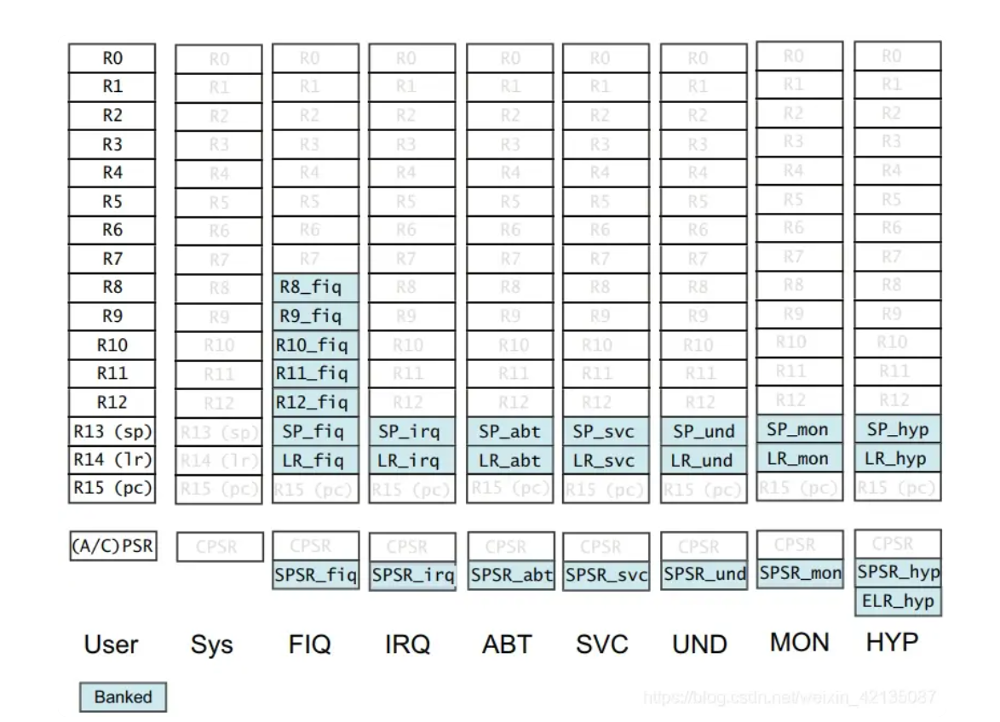

# ARM架构高效C编程labs
实验环境 arm-linux-gnueabi-gcc (Ubuntu 11.4.0-1ubuntu1~22.04) 11.4.0
寄存器说明


## 1. 测试8bit与32bit的O2优化
代码与流程
C语言片段1
```c
int check_sum_v1(int * data){
    char i;
    int sum = 0;
    
    for( i = 0;i < 64;++i){
        sum += data[i];
    }
    return sum;
}
```
compile并且输出O2优化的汇编结果
```assembly
00000010 <check_sum_v1>:
  10:	e3a02000 	mov	r2, #0
  14:	e2403004 	sub	r3, r0, #4
  18:	e28000fc 	add	r0, r0, #252	; 0xfc
  1c:	e5b31004 	ldr	r1, [r3, #4]!
  20:	e1530000 	cmp	r3, r0
  24:	e0822001 	add	r2, r2, r1
  28:	1afffffb 	bne	1c <check_sum_v1+0xc>
  2c:	e1a00002 	mov	r0, r2
  30:	e12fff1e 	bx	lr
```
代码片段2
```c
int check_sum_v2(int * data){
    int i;
    int sum = 0;
    
    for( i = 0;i < 64;++i){
        sum += data[i];
    }
    return sum;
}
```
compile并且输出O2优化的汇编结果
```assembly
00000010 <check_sum_v2>:
  10:	e3a02000 	mov	r2, #0
  14:	e2403004 	sub	r3, r0, #4
  18:	e28000fc 	add	r0, r0, #252	; 0xfc
  1c:	e5b31004 	ldr	r1, [r3, #4]!
  20:	e1530000 	cmp	r3, r0
  24:	e0822001 	add	r2, r2, r1
  28:	1afffffb 	bne	1c <check_sum_v2+0xc>
  2c:	e1a00002 	mov	r0, r2
  30:	e12fff1e 	bx	lr
```
在ARM嵌入式系统开发，软件设计与优化这本书中，汇编代码有显著差异，具体体现在v1版本的汇编代码需要处理char类型的溢出，而v2不需要。

## 2.测试除法的无符号版本优势
代码片段1
```c
int avg_test(int parama,int paramb){
    return (parama + paramb)/2;
}
```
汇编代码
```assembly
000000dc <avg_test>:
  dc:	e52db004 	push	{fp}		; (str fp, [sp, #-4]!)
  e0:	e28db000 	add	fp, sp, #0
  e4:	e24dd00c 	sub	sp, sp, #12
  e8:	e50b0008 	str	r0, [fp, #-8]
  ec:	e50b100c 	str	r1, [fp, #-12]
  f0:	e51b2008 	ldr	r2, [fp, #-8]
  f4:	e51b300c 	ldr	r3, [fp, #-12]
  f8:	e0823003 	add	r3, r2, r3
  fc:	e1a02fa3 	lsr	r2, r3, #31
 100:	e0823003 	add	r3, r2, r3
 104:	e1a030c3 	asr	r3, r3, #1
 108:	e1a00003 	mov	r0, r3
 10c:	e28bd000 	add	sp, fp, #0
 110:	e49db004 	pop	{fp}		; (ldr fp, [sp], #4)
 114:	e12fff1e 	bx	lr
```
代码片段2
```c
int avg_test_unsigned(unsigned int parama,unsigned int paramb){
    return (parama + paramb)/2;
}
```

```
00000118 <avg_test_unsigned>:
 118:	e52db004 	push	{fp}		; (str fp, [sp, #-4]!)
 11c:	e28db000 	add	fp, sp, #0
 120:	e24dd00c 	sub	sp, sp, #12
 124:	e50b0008 	str	r0, [fp, #-8]
 128:	e50b100c 	str	r1, [fp, #-12]
 12c:	e51b2008 	ldr	r2, [fp, #-8]
 130:	e51b300c 	ldr	r3, [fp, #-12]
 134:	e0823003 	add	r3, r2, r3
 138:	e1a030a3 	lsr	r3, r3, #1
 13c:	e1a00003 	mov	r0, r3
 140:	e28bd000 	add	sp, fp, #0
 144:	e49db004 	pop	{fp}		; (ldr fp, [sp], #4)
 148:	e12fff1e 	bx	lr
```
unsigned版本需要比带符号的版本多出两条汇编指令,这是因为带符号的版本需要使用add指令处理符号
## 3.关于循环
### do-while的优势
代码对比
```c
int check_sum_v4(int * data, int N){
    unsigned int i;
    int sum = 0;
    
    for( i = N;i != 0;i--){
        sum += *(data++);
    }
    return sum;
}

int check_sum_v5(int * data, int N){
    unsigned int i;
    int sum = 0;
    
    do {
        sum += *(data++);
    } while(--N);
    return sum;
}
```
汇编对比
```
000000a4 <check_sum_v4>:
  a4:	e1a03000 	mov	r3, r0
  a8:	e3510000 	cmp	r1, #0
  ac:	0a000005 	beq	c8 <check_sum_v4+0x24>
  b0:	e3a00000 	mov	r0, #0
  b4:	e4932004 	ldr	r2, [r3], #4
  b8:	e0800002 	add	r0, r0, r2
  bc:	e2511001 	subs	r1, r1, #1
  c0:	1afffffb 	bne	b4 <check_sum_v4+0x10>
  c4:	e12fff1e 	bx	lr
  c8:	e3a00000 	mov	r0, #0
  cc:	e12fff1e 	bx	lr

000000d0 <check_sum_v5>:
  d0:	e1a03000 	mov	r3, r0
  d4:	e3a00000 	mov	r0, #0
  d8:	e4932004 	ldr	r2, [r3], #4
  dc:	e0800002 	add	r0, r0, r2
  e0:	e2511001 	subs	r1, r1, #1
  e4:	1afffffb 	bne	d8 <check_sum_v5+0x8>
  e8:	e12fff1e 	bx	lr
```
由于不对N进行校验，能省4个指令周期
### 循环展开(极限时才需要使用到)
循环每次步进长度为4来减少2条退出判断指令的开销，公式不在这里给出很好推


