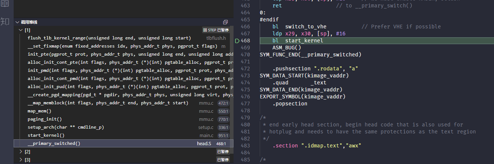

# SMP 启动过程学习
环境:ubuntu 22.04 LTS WSL2 
    qemu-system-aarch64 6.2.0
    kernek 5.19

## SMP启动流程
从head.S开始分析，主要流程如下
```c
+-- _text()                                 /// 内核启动入口
    \-- primary_entry()
        +-- preserve_boot_args()            /// 保存x0~x3到boot_args[0~3]
        +-- init_kernel_el()                /// 根据内核运行异常等级进行配置，返回启动模式
        |   +-- init_el1()                  /// 通常情况下从EL1启动内核
        |   \-- init_el2()                  /// 从EL2启动内核，用于开启VHE(Virtualization Host Extensions)
        +-- create_idmap()                  /// 建立恒等映射init_idmap_pg_dir和内核镜像映射init_pg_dir的页表
        +-- __cpu_setup()                   /// 为开启MMU做的CPU初始化
        \-- __primary_switch()
            +-- __enable_mmu()              /// 开启MMU，将init_idmap_pg_dir加载到ttbr0，reserved_pg_dir加载到ttbr1
            +-- clear_page_tables()         /// 清空init_pg_dir
            +-- create_kernel_mapping()     /// 填充init_pg_dir
            +-- load_ttbr1()                /// 将init_pg_dir加载到ttbr1
            \-- __primary_switched()        /// 初始化init_task栈，设置VBAR_EL1，保存FDT地址，计算kimage_voffset，清空bss段
                +-- set_cpu_boot_mode_flag()/// 设置__boot_cpu_mode变量
                +-- early_fdt_map()
                |   +-- early_fixmap_init() /// 尝试建立fixmap的页表，可能失败，后边init_feature_override会用到
                |   \-- fixmap_remap_fdt()  /// 如果成功建立fixmap页表，将fdt映射到fixmap的FIX_FDT区域
                +-- init_feature_override() /// 根据BootLoader传入的bootargs，对一些参数的改写
                +-- finalise_el2()          /// Prefer VHE if possible
                \-- start_kernel()          /// 跳转到start_kernel执行
```
start_kernel的定义如下
```c
asmlinkage __visible void __init __no_sanitize_address start_kernel(void)
{
	char *command_line;
	char *after_dashes;

	set_task_stack_end_magic(&init_task);
	smp_setup_processor_id();
	debug_objects_early_init();
	init_vmlinux_build_id();

	cgroup_init_early();

	local_irq_disable();
	early_boot_irqs_disabled = true;

	/*
	 * Interrupts are still disabled. Do necessary setups, then
	 * enable them.
	 */
	boot_cpu_init();
	page_address_init();
	pr_notice("%s", linux_banner);
	early_security_init();
	setup_arch(&command_line);
	setup_boot_config();
	setup_command_line(command_line);
	setup_nr_cpu_ids();
	setup_per_cpu_areas();
	smp_prepare_boot_cpu();	/* arch-specific boot-cpu hooks */
	boot_cpu_hotplug_init();

	build_all_zonelists(NULL);
	page_alloc_init();

	pr_notice("Kernel command line: %s\n", saved_command_line);
	/* parameters may set static keys */
	jump_label_init();
	parse_early_param();
	after_dashes = parse_args("Booting kernel",
				  static_command_line, __start___param,
				  __stop___param - __start___param,
				  -1, -1, NULL, &unknown_bootoption);
	print_unknown_bootoptions();
	if (!IS_ERR_OR_NULL(after_dashes))
		parse_args("Setting init args", after_dashes, NULL, 0, -1, -1,
			   NULL, set_init_arg);
	if (extra_init_args)
		parse_args("Setting extra init args", extra_init_args,
			   NULL, 0, -1, -1, NULL, set_init_arg);

	/*
	 * These use large bootmem allocations and must precede
	 * kmem_cache_init()
	 */
	setup_log_buf(0);
	vfs_caches_init_early();
	sort_main_extable();
	trap_init();
	mm_init();

	ftrace_init();

	/* trace_printk can be enabled here */
	early_trace_init();

	/*
	 * Set up the scheduler prior starting any interrupts (such as the
	 * timer interrupt). Full topology setup happens at smp_init()
	 * time - but meanwhile we still have a functioning scheduler.
	 */
	sched_init();

	if (WARN(!irqs_disabled(),
		 "Interrupts were enabled *very* early, fixing it\n"))
		local_irq_disable();
	radix_tree_init();

	/*
	 * Set up housekeeping before setting up workqueues to allow the unbound
	 * workqueue to take non-housekeeping into account.
	 */
	housekeeping_init();

	/*
	 * Allow workqueue creation and work item queueing/cancelling
	 * early.  Work item execution depends on kthreads and starts after
	 * workqueue_init().
	 */
	workqueue_init_early();

	rcu_init();

	/* Trace events are available after this */
	trace_init();

	if (initcall_debug)
		initcall_debug_enable();

	context_tracking_init();
	/* init some links before init_ISA_irqs() */
	early_irq_init();
	init_IRQ();
	tick_init();
	rcu_init_nohz();
	init_timers();
	srcu_init();
	hrtimers_init();
	softirq_init();
	timekeeping_init();
	kfence_init();
	time_init();

	/*
	 * For best initial stack canary entropy, prepare it after:
	 * - setup_arch() for any UEFI RNG entropy and boot cmdline access
	 * - timekeeping_init() for ktime entropy used in random_init()
	 * - time_init() for making random_get_entropy() work on some platforms
	 * - random_init() to initialize the RNG from from early entropy sources
	 */
	random_init(command_line);
	boot_init_stack_canary();

	perf_event_init();
	profile_init();
	call_function_init();
	WARN(!irqs_disabled(), "Interrupts were enabled early\n");

	early_boot_irqs_disabled = false;
	local_irq_enable();

	kmem_cache_init_late();

	/*
	 * HACK ALERT! This is early. We're enabling the console before
	 * we've done PCI setups etc, and console_init() must be aware of
	 * this. But we do want output early, in case something goes wrong.
	 */
	console_init();
	if (panic_later)
		panic("Too many boot %s vars at `%s'", panic_later,
		      panic_param);

	lockdep_init();

	/*
	 * Need to run this when irqs are enabled, because it wants
	 * to self-test [hard/soft]-irqs on/off lock inversion bugs
	 * too:
	 */
	locking_selftest();

	/*
	 * This needs to be called before any devices perform DMA
	 * operations that might use the SWIOTLB bounce buffers. It will
	 * mark the bounce buffers as decrypted so that their usage will
	 * not cause "plain-text" data to be decrypted when accessed.
	 */
	mem_encrypt_init();

#ifdef CONFIG_BLK_DEV_INITRD
	if (initrd_start && !initrd_below_start_ok &&
	    page_to_pfn(virt_to_page((void *)initrd_start)) < min_low_pfn) {
		pr_crit("initrd overwritten (0x%08lx < 0x%08lx) - disabling it.\n",
		    page_to_pfn(virt_to_page((void *)initrd_start)),
		    min_low_pfn);
		initrd_start = 0;
	}
#endif
	setup_per_cpu_pageset();
	numa_policy_init();
	acpi_early_init();
	if (late_time_init)
		late_time_init();
	sched_clock_init();
	calibrate_delay();
	pid_idr_init();
	anon_vma_init();
#ifdef CONFIG_X86
	if (efi_enabled(EFI_RUNTIME_SERVICES))
		efi_enter_virtual_mode();
#endif
	thread_stack_cache_init();
	cred_init();
	fork_init();
	proc_caches_init();
	uts_ns_init();
	key_init();
	security_init();
	dbg_late_init();
	net_ns_init();
	vfs_caches_init();
	pagecache_init();
	signals_init();
	seq_file_init();
	proc_root_init();
	nsfs_init();
	cpuset_init();
	cgroup_init();
	taskstats_init_early();
	delayacct_init();

	poking_init();
	check_bugs();

	acpi_subsystem_init();
	arch_post_acpi_subsys_init();
	kcsan_init();

	/* Do the rest non-__init'ed, we're now alive */
	arch_call_rest_init();

	prevent_tail_call_optimization();
}
```
linux中的start_kernel调用栈如下



与SMP相关的函数如下
|从属步骤|函数|功能|
|---|---|---|
|start_kernel|smp_setup_processor_id|建立bootcpuid与其hwid的映射关系,其中hwid由mpidr描述。是ARM芯片中的一个寄存器MPIDR_EL1，用于指示芯片中的物理与逻辑位置|
|start_kernel|boot_cpu_init|将bootcpu的online,active,possible,present都设置成1，这些位的含义稍后将详细介绍，__boot_cpu_id的id也将被设置|
|start_kernel-setup_arch|init_bootcpu_ops|初始化bootcpu的回调|
|start_kernel-setup_arch|psci_dt_init|设置通道位SMC(安全监控调用)或者HVC（虚拟机监控程序调用）|
|start_kernel-setup_arch|smp_init_cpus|初始化其他CPU并且分配到__cpu_logical_map的映射关系,在这里还会处理NUMA相关的操作，具体的:会将cpu与socket-node之间建立关系|
|start_kernel-setup_arch|smp_build_mpidr_hash|通过mpidr建立hash表|
|start_kernel|setup_per_cpu_areas|分配percpu区域|
|start_kernel|arch_call_rest_init|这个下面会进行深入的分析|


PSCI的ops定义，在ARM中，电源管理接口为psci。当前一共包含0.1、0.2和1.0三个版本，.用于以下的场景
1. cpuidle管理
2. hotplug与secondary cpu启动
3. shutdown与reset

psci.c中02版本的定义如下
```c
psci_ops = (struct psci_operations){
		.get_version = psci_0_2_get_version,
		.cpu_suspend = psci_0_2_cpu_suspend,
		.cpu_off = psci_0_2_cpu_off,
		.cpu_on = psci_0_2_cpu_on,
		.migrate = psci_0_2_migrate,
		.affinity_info = psci_affinity_info,
		.migrate_info_type = psci_migrate_info_type,
	};
```

## arch_call_rest_init
代码如下
```c
noinline void __ref rest_init(void)
{
	struct task_struct *tsk;
	int pid;

	rcu_scheduler_starting();
	/*
	 * We need to spawn init first so that it obtains pid 1, however
	 * the init task will end up wanting to create kthreads, which, if
	 * we schedule it before we create kthreadd, will OOPS.
	 */
	pid = user_mode_thread(kernel_init, NULL, CLONE_FS);
	/*
	 * Pin init on the boot CPU. Task migration is not properly working
	 * until sched_init_smp() has been run. It will set the allowed
	 * CPUs for init to the non isolated CPUs.
	 */
	rcu_read_lock();
	tsk = find_task_by_pid_ns(pid, &init_pid_ns);
	tsk->flags |= PF_NO_SETAFFINITY;
	set_cpus_allowed_ptr(tsk, cpumask_of(smp_processor_id()));
	rcu_read_unlock();

	numa_default_policy();
	pid = kernel_thread(kthreadd, NULL, CLONE_FS | CLONE_FILES);
	rcu_read_lock();
	kthreadd_task = find_task_by_pid_ns(pid, &init_pid_ns);
	rcu_read_unlock();

	/*
	 * Enable might_sleep() and smp_processor_id() checks.
	 * They cannot be enabled earlier because with CONFIG_PREEMPTION=y
	 * kernel_thread() would trigger might_sleep() splats. With
	 * CONFIG_PREEMPT_VOLUNTARY=y the init task might have scheduled
	 * already, but it's stuck on the kthreadd_done completion.
	 */
	system_state = SYSTEM_SCHEDULING;

	complete(&kthreadd_done);

	/*
	 * The boot idle thread must execute schedule()
	 * at least once to get things moving:
	 */
	schedule_preempt_disabled();
	/* Call into cpu_idle with preempt disabled */
	cpu_startup_entry(CPUHP_ONLINE);
}
```
主要完成了绑定kernel_init进程到启动CPU，并且创建kthreadd线程,kthreadd用于管理和调度其他线程。
## arm-linux中的变量分析
