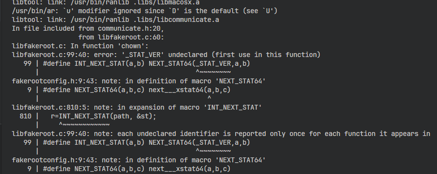
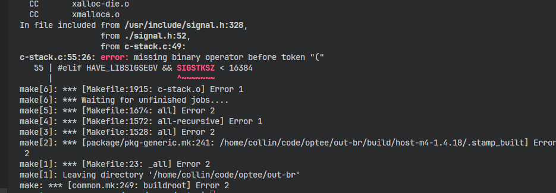

# software env
microsoft-standard-WSL2 ubuntu 22.04
# exam env setup 
use optee to exam,what is optee ? can be seen at https://optee.readthedocs.io/en/latest/building/index.html

## getcode
```bash
mkdir -p optee
cd optee
repo init -u https://github.com/OP-TEE/manifest.git -m qemu_v8.xml
repo sync -j4 --no-clone-bundle
```
## build and set up vscode-gdb
```bash
cd ~/optee/build
make -j2 toolchains
bear -- make run -j4
```

## set up vscode code jump 
```bash
cd ..
cp build/compile_commands.json ./.vscode/
```
configure the .vscode folder's settings.json like follow 
```json
{
    // clangd可执行文件路径（如果不在系统PATH中）
    "clangd.path": "/usr/bin/clangd",
    // clangd启动参数
    "clangd.arguments": [
        "--background-index",
        "--compile-commands-dir=${workspaceFolder}/.vscode",
        "--completion-style=detailed",
        "--header-insertion=never",
        "--log=info"
    ],
}
```
## some questions and solutions

1. fakeroot build error ,add the following code to libfakeroot.c 
```c
#ifndef _STAT_VER
 #if defined (__aarch64__)
  #define _STAT_VER 0
 #elif defined (__x86_64__)
  #define _STAT_VER 1
 #else
  #define _STAT_VER 3
 #endif
#endif
```
2. m4 build error

google and change define 


