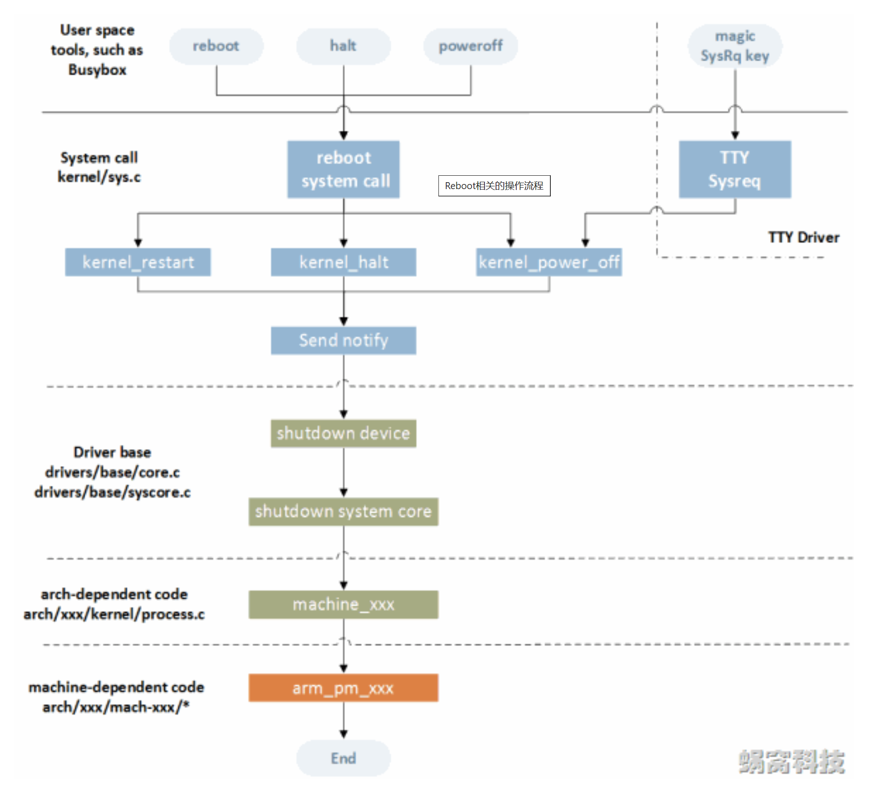

arm-linux电源管理(一) Rboot/poweroff/halt流程
# 总体架构

# qemu调试过程
reboot,halt,poweroff都是由reboot syscall触发。定义如下
```c
SYSCALL_DEFINE4(reboot, int, magic1, int, magic2, unsigned int, cmd,
		void __user *, arg)
```
在kernel_power_off打上断点之后，在目标机中运行
```bash
busybox poweroff
```
kernel_power_off函数定义如下
```c
void kernel_power_off(void)
{
	kernel_shutdown_prepare(SYSTEM_POWER_OFF);
	do_kernel_power_off_prepare();
	migrate_to_reboot_cpu();
	syscore_shutdown();
	pr_emerg("Power down\n");
	kmsg_dump(KMSG_DUMP_SHUTDOWN);
	machine_power_off();
}
```
各个步骤的作用如下
|步骤|细分步骤|作用|要点|
|----|----|-----|----|
|kernel_shutdown_prepare|blocking_notifier_call_chain|通过blocking_notifier_call_chain调用通过register_reboot_notifier注册好的回调||
|kernel_shutdown_prepare|usermodehelper_disable|禁用内核调用用户态程序的功能|1.防止新的用户态程序创建 2.保证关机流程的纯净性|
|kernel_shutdown_prepare|device_shutdown|依次执行class,bus,driver的shutdown流程||
|do_kernel_power_off_prepare|blocking_notifier_call_chain|调用注册到power_off_prep_handler_list中的回调||
|migrate_to_reboot_cpu|cpu_hotplug_disable等|禁止热插拔并且将当前任务迁移到reboot cpu||
|syscore_shutdown|syscore_ops_list->shutdown|调用注册到syscorelist上的shuwdown回调||
|machine_power_off|local_irq_disable && smp_send_stop && do_kernel_power_off|关中断并且关闭其他cpu,最后通过pm_power_off调用扳级的off回调||

至于reboot和halt总体的流程是类似的，不再重复分析


