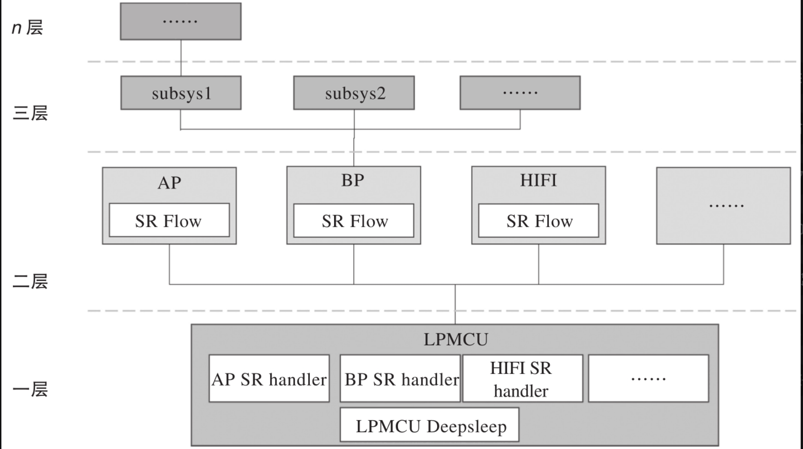
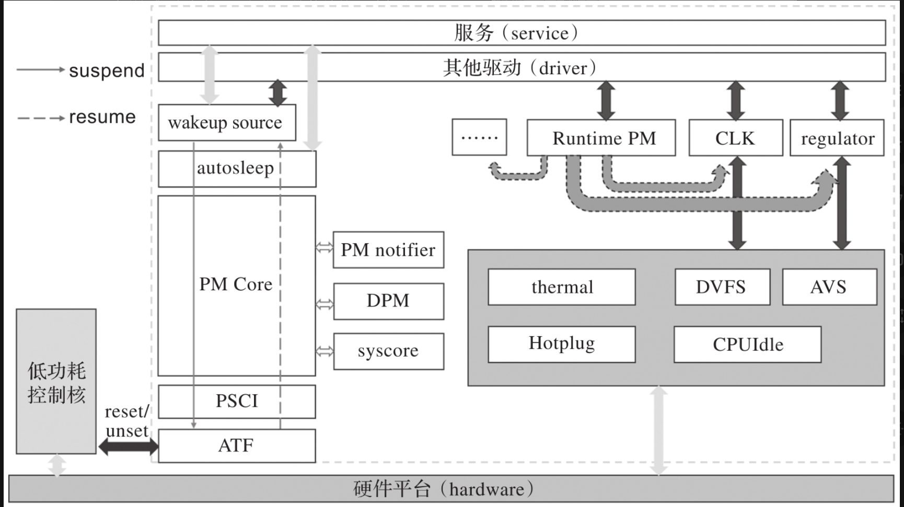

# chapter1 基础知识

## 降低功耗三种思路
|方式|原理|
|---|--|
|升级生产工艺|制程越高，芯片器件间的导线越短，线损越小|
|降低工作电压，电流|P=UI|
|多电源域设计|闲时即关|

## 低功耗架构
在比较复杂的嵌入式系统中，会有独立的MCU进行各个电源域的上下电控制。上面跑着独立的固件(典型的为SCP)

linux平台的低功耗框架类似下图

各个模块的功能
|模块|功能|
|---|---|
|wakeup source|提供睡眠锁的功能|
|autosleep|休眠的入口,系统没有组件持有睡眠锁时，触发autosleep进入睡眠流程|
|PM core|休眠唤醒主流程,对各个组成模块注册的休眠唤醒进行调用|
|PM notifiler|基于notifier机制，对各个模块进行注册，当系统进入休眠时，会调用各个模块的休眠函数|
|DPM|设备电源管理，内核给各个设备注册低功耗处理机制，支持优先级|
|syscore|支持suspend与resume回调，该级别的回调屏蔽了中断上下文|
|PSCI|电源状态协调接口|
|ATF|ARM Trusted Firmware，支持安全世界的低功耗操作|
|RunTime PM|提供运行时的电源管理，对某些模块单独供电或单独供时钟|
|CLK|负责对时钟的管理|
|regulator|负责对供电的管理|
|thermal|温控中心|
|DVFS|动态调频调压|
|AVS|自适应电压缩放|
|Hotplug|CPU热插拔|
|CPUIdle|不睡眠状态下&&CPU无任务调度时的状态，通常进入WFI|

