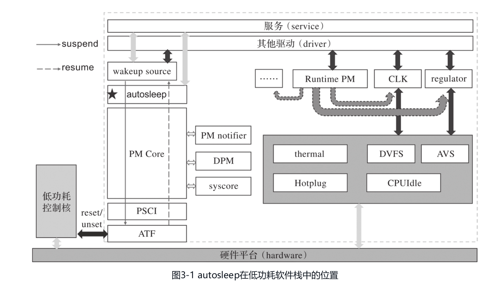
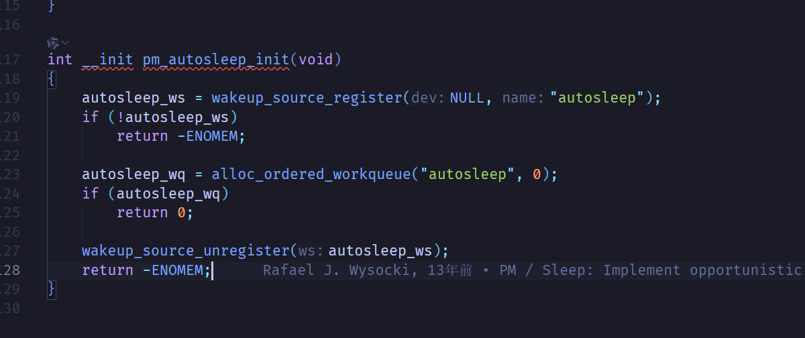
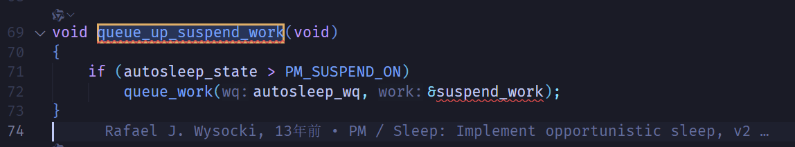
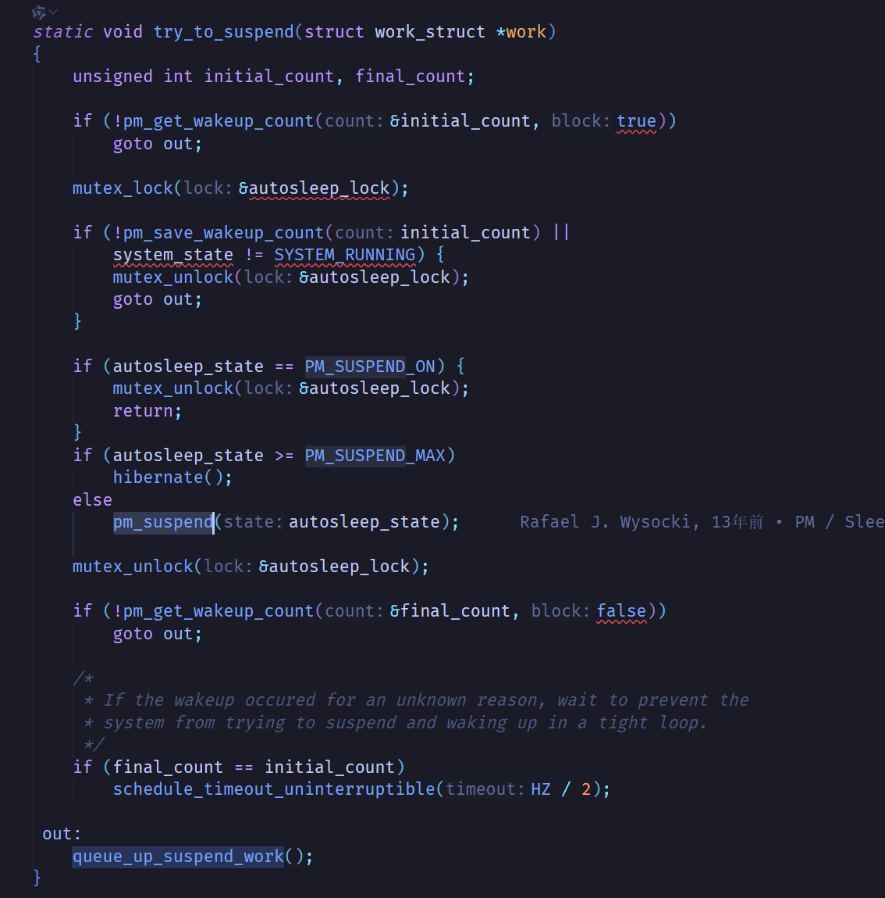

# wakeup source
## 什么是wakeup source？
本质上是一个使用原子变量实现的计数锁机制。基于一个原子变量combined_event_count。前16位为已经处理的值，后16位为当前正在持有睡眠锁的计数值，主要实现如下的功能

1. 持有锁
2. 释放锁
3. 注册锁
4. 注销锁

## 数据结构
```c
struct wakeup_source {
	const char 		*name;
	int			id;
	struct list_head	entry;
	spinlock_t		lock;
	struct wake_irq		*wakeirq;
	struct timer_list	timer;
	unsigned long		timer_expires;
	ktime_t total_time;
	ktime_t max_time;
	ktime_t last_time;
	ktime_t start_prevent_time;
	ktime_t prevent_sleep_time;
	unsigned long		event_count;
	unsigned long		active_count;
	unsigned long		relax_count;
	unsigned long		expire_count;
	unsigned long		wakeup_count;
	struct device		*dev;
	bool			active:1;
	bool			autosleep_enabled:1;
};
```
维护一个wakeup_source类型的全局列表wakeup_sources以及上文提到的combined_event_count变量
## 主要使用的API
|API|实现|
|-------|-------|
|wakeup_source_register|加入到全局wakeup_sources列表中|
|wakeup_source_unregister|从全局列表中删除|
|pm_stay_awake|禁用中断之后调用__pm_stay_awake|
|__pm_stay_awake|增加combined_event_count|
|pm_relax与__pm_stay_realeax|上面的反过程，并且会增加到前16位中|

# autosleep

PMcore中的休眠唤醒入口
## 主要api的设计与实现
|API|实现|源代码|
|---|---|---|
|pm_auto_sleep_init|使用上节描述的wakeup_sources与combined_event_count创建睡眠锁，并创建一个工作队列||
|queue_up_suspend_work|在工作队列中添加try_to_suspend|| 
|try_to_suspend|检查当前的睡眠锁状态，并且调用pm_suspend进入睡眠||