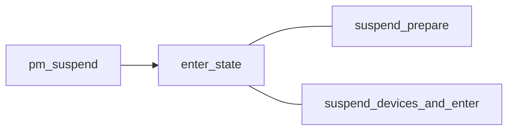

# PM Core
休眠唤醒主流程，将各个低功耗睡眠的模块组合在一起
## PM Core数据结构
系统低功耗要进入的状态为suspend_stat_t描述的枚举，枚举具体可取的数值如下
```c
#define PM_SUSPEND_ON		((__force suspend_state_t) 0)
#define PM_SUSPEND_TO_IDLE	((__force suspend_state_t) 1)
#define PM_SUSPEND_STANDBY	((__force suspend_state_t) 2)
#define PM_SUSPEND_MEM		((__force suspend_state_t) 3)
#define PM_SUSPEND_MIN		PM_SUSPEND_TO_IDLE
#define PM_SUSPEND_MAX		((__force suspend_state_t) 4)
```
各个枚举值代表的含义如下表所示
|值|含义|
|---|---|
|PM_SUSPEND_ON|设备处于正常的工作状态|
|PM_SUSPEND_TO_IDLE|拔掉从核|
|PM_SUSPEND_STANDBY|设备处于省电状态|
|PM_SUSPEND_MEM|设备处于STR状态，挂起到内存|

suspend_states的结构体描述如下所示
```c
struct suspend_stats {
	int	success;
	int	fail;
	int	failed_freeze;
	int	failed_prepare;
	int	failed_suspend;
	int	failed_suspend_late;
	int	failed_suspend_noirq;
	int	failed_resume;
	int	failed_resume_early;
	int	failed_resume_noirq;
#define	REC_FAILED_NUM	2
	int	last_failed_dev;
	char	failed_devs[REC_FAILED_NUM][40];
	int	last_failed_errno;
	int	errno[REC_FAILED_NUM];
	int	last_failed_step;
	enum suspend_stat_step	failed_steps[REC_FAILED_NUM];
};
```
主要用于记录休眠唤醒的成功失败状态
```c
struct platform_suspend_ops {
	int (*valid)(suspend_state_t state);
	int (*begin)(suspend_state_t state);
	int (*prepare)(void);
	int (*prepare_late)(void);
	int (*enter)(suspend_state_t state);
	void (*wake)(void);
	void (*finish)(void);
	bool (*suspend_again)(void);
	void (*end)(void);
	void (*recover)(void);

	ANDROID_KABI_RESERVE(1);
};
```
低功耗休眠流程调用的主要流程如下图,为了从简处理，所有的错误处理与参数验证，日志打印都将被忽略


在suspend_device_and_enter的流程中调用的suspend_enter实现如下
```c
static int suspend_enter(suspend_state_t state, bool *wakeup)
{
	int error, last_dev;

	error = platform_suspend_prepare(state);
	if (error)
		goto Platform_finish;

	error = dpm_suspend_late(PMSG_SUSPEND);
	if (error) {
		last_dev = suspend_stats.last_failed_dev + REC_FAILED_NUM - 1;
		last_dev %= REC_FAILED_NUM;
		pr_err("late suspend of devices failed\n");
		log_suspend_abort_reason("late suspend of %s device failed",
					 suspend_stats.failed_devs[last_dev]);
		goto Platform_finish;
	}
	error = platform_suspend_prepare_late(state);
	if (error)
		goto Devices_early_resume;

	error = dpm_suspend_noirq(PMSG_SUSPEND);
	if (error) {
		last_dev = suspend_stats.last_failed_dev + REC_FAILED_NUM - 1;
		last_dev %= REC_FAILED_NUM;
		pr_err("noirq suspend of devices failed\n");
		log_suspend_abort_reason("noirq suspend of %s device failed",
					 suspend_stats.failed_devs[last_dev]);
		goto Platform_early_resume;
	}
	error = platform_suspend_prepare_noirq(state);
	if (error)
		goto Platform_wake;

	if (suspend_test(TEST_PLATFORM))
		goto Platform_wake;

	if (state == PM_SUSPEND_TO_IDLE) {
		s2idle_loop();
		goto Platform_wake;
	}

	error = suspend_disable_secondary_cpus();
	if (error || suspend_test(TEST_CPUS)) {
		log_suspend_abort_reason("Disabling non-boot cpus failed");
		goto Enable_cpus;
	}

	arch_suspend_disable_irqs();
	BUG_ON(!irqs_disabled());

	system_state = SYSTEM_SUSPEND;

	error = syscore_suspend();
	if (!error) {
		*wakeup = pm_wakeup_pending();
		if (!(suspend_test(TEST_CORE) || *wakeup)) {
			trace_suspend_resume(TPS("machine_suspend"),
				state, true);
			error = suspend_ops->enter(state);
			trace_suspend_resume(TPS("machine_suspend"),
				state, false);
		} else if (*wakeup) {
			error = -EBUSY;
		}
		syscore_resume();
	}

	system_state = SYSTEM_RUNNING;

	arch_suspend_enable_irqs();
	BUG_ON(irqs_disabled());

 Enable_cpus:
	suspend_enable_secondary_cpus();

 Platform_wake:
	platform_resume_noirq(state);
	dpm_resume_noirq(PMSG_RESUME);

 Platform_early_resume:
	platform_resume_early(state);

 Devices_early_resume:
	dpm_resume_early(PMSG_RESUME);

 Platform_finish:
	platform_resume_finish(state);
	return error;
}
```
suspend_disable_secondary_cpus关闭了SMP架构中的非启动核， suspend_ops->enter(state);则完成了psci中的suspend。唤醒流程为休眠过程的逆过程，不再赘述
# notifier


