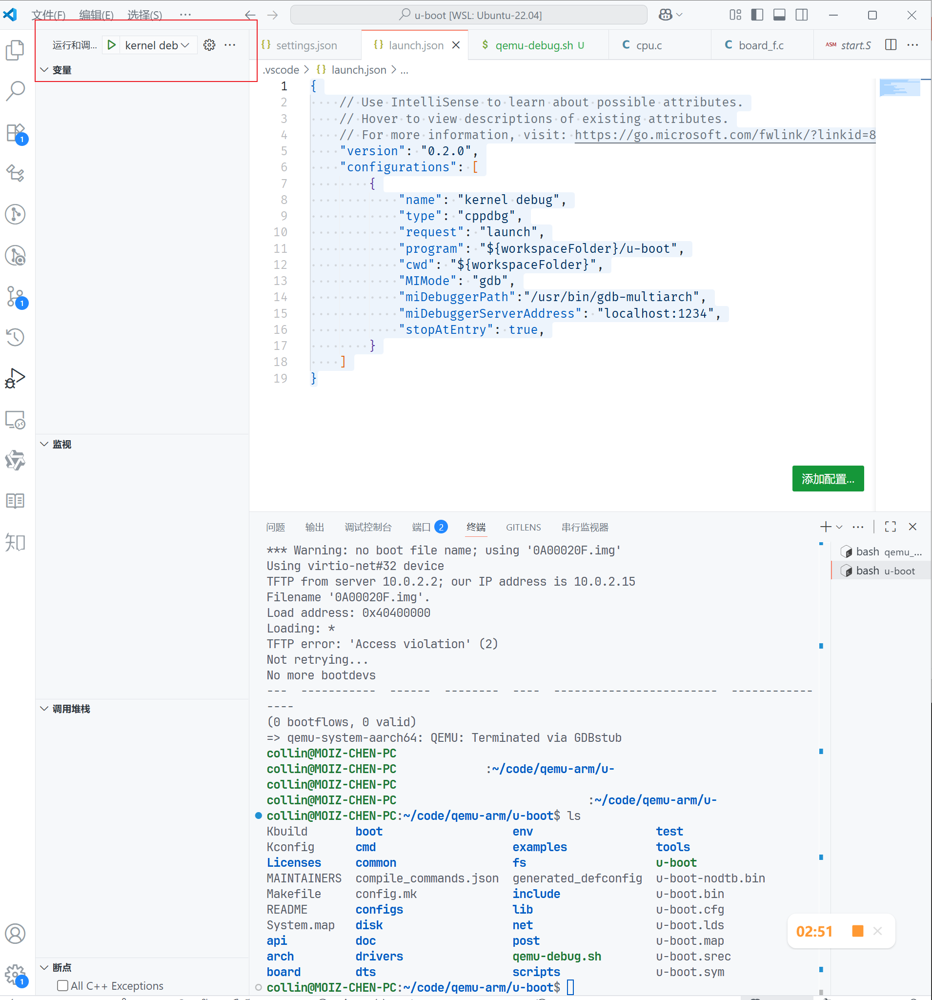
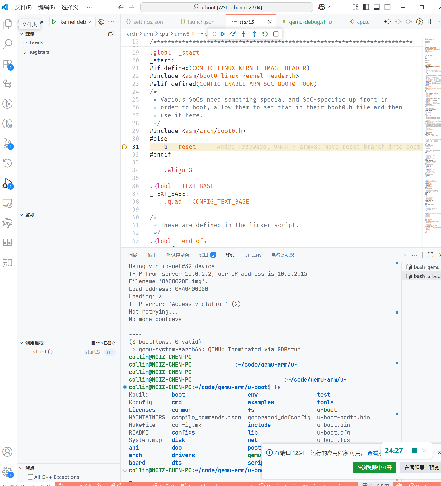

# 实验平台
ubuntu 22.04 on windows 11 WSL2

# 代码下载与编译
前置依赖:
1. 存在交叉编译器
2. 存在qemu虚拟环境
3. 存在bear
4. 存在GDB
```bash
git clone https://git.denx.de/u-boot
cd u-boot
make ARCH=arm CROSS_COMPILE=aarch64-linux-gnu- qemu_arm64_defconfig
bear -- make ARCH=arm CROSS_COMPILE=aarch64-linux-gnu-
```
# vscode配置
workspace 新建一个.vscode文件夹，settings.json 设置如下
```json
{
    "clangd.arguments": [
        "--compile-commands-dir=${workspaceFolder}",
        "--background-index",
        "--clang-tidy",
        "--header-insertion=iwyu",
        "--completion-style=detailed",
        "--fallback-style=google"
    ],
    "clangd.path": "/usr/bin/clangd"
}
```
launch.json 配置如下
```json
    {
    // Use IntelliSense to learn about possible attributes.
    // Hover to view descriptions of existing attributes.
    // For more information, visit: https://go.microsoft.com/fwlink/?linkid=830387
    "version": "0.2.0",
    "configurations": [
        {
            "name": "kernel debug",
            "type": "cppdbg",
            "request": "launch",
            "program": "${workspaceFolder}/u-boot",
            "cwd": "${workspaceFolder}",
            "MIMode": "gdb",
            "miDebuggerPath":"/usr/bin/gdb-multiarch",
            "miDebuggerServerAddress": "localhost:1234",
            "stopAtEntry": true,
        }
    ]
}
```
# 调试方式
workspace 新建一个run.sh如下
```bash
#!/bin/bash
qemu-system-aarch64 -machine virt \
        -nographic \
        -m 512M \
        -cpu cortex-a57 \
        -kernel u-boot \
        -s -S
```
点击vscode的调试

运行run.sh，成功后的效果如下图

